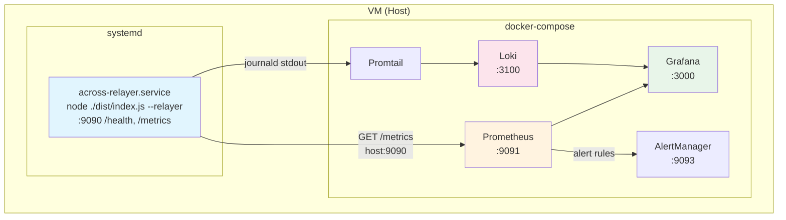
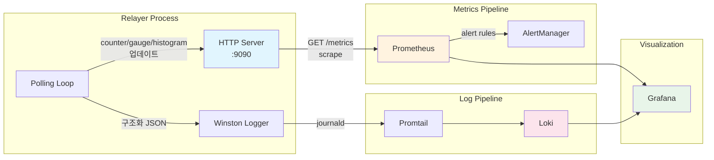
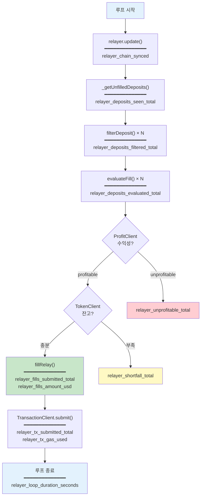
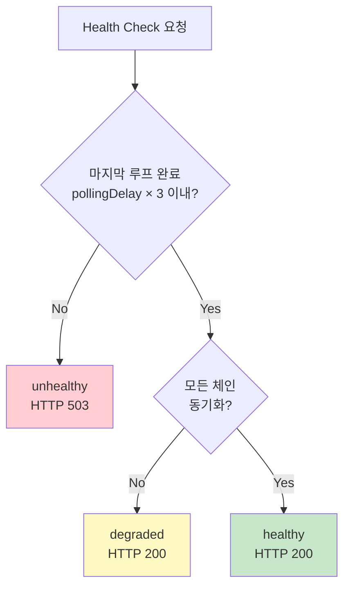
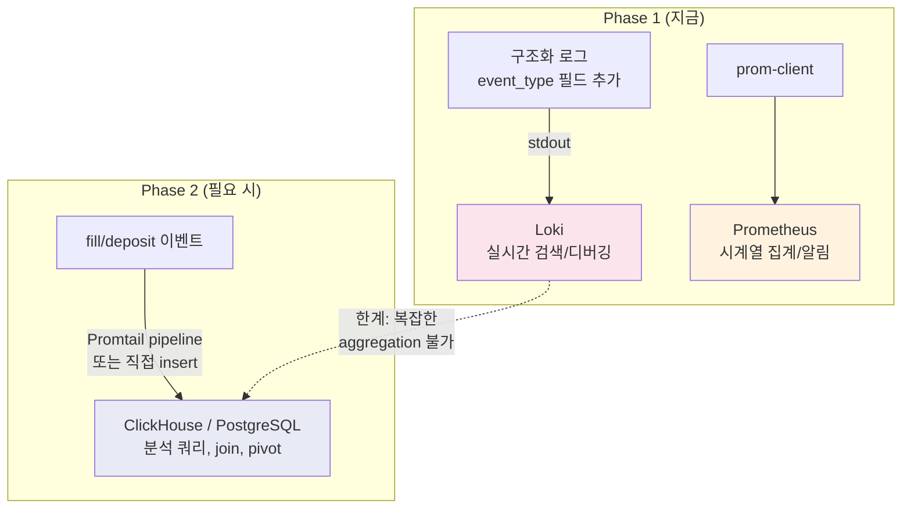

# Relayer Observability Spec

Relayer 프로세스의 health check, Prometheus 메트릭스, 로그 수집 전략을 정의한 스펙 문서.

> **Go 개발자 참고**: prom-client는 Go의 `prometheus/client_golang`과 거의 동일한 API.
> `new Counter()` ≈ `prometheus.NewCounterVec()`, `new Histogram()` ≈ `prometheus.NewHistogramVec()`.
> MetricsServer는 Go의 `http.Handle("/metrics", promhttp.Handler())` 패턴과 동일.

---

## 목차

1. [목표 & 범위](#1-목표--범위)
2. [아키텍처](#2-아키텍처)
3. [Health Endpoint Spec](#3-health-endpoint-spec)
4. [Metrics Spec](#4-metrics-spec)
5. [이벤트 데이터 저장 전략](#5-이벤트-데이터-저장-전략)
6. [환경변수](#6-환경변수)
7. [구현 파일 목록](#7-구현-파일-목록)
8. [Helm 연동](#8-helm-연동)
9. [Grafana 대시보드 설계](#9-grafana-대시보드-설계)

---

## 1. 목표 & 범위

### 목표

| 목표 | 설명 |
|------|------|
| **Health check** | Relayer 프로세스 liveness + 폴링 루프 정상 동작 확인 |
| **병목 감지** | deposit 수신 → 필터 → 수익성 판정 → tx 제출 각 단계의 처리량/지연/실패 추적 |
| **운영 알림** | fill 실패, shortfall, 루프 지연 시 AlertManager 연동 |

### 범위

| 포함 | 제외 |
|------|------|
| `/health` endpoint | OpenTelemetry tracing (단일 프로세스, 우선순위 낮음) |
| `/metrics` endpoint (Prometheus) | 커스텀 대시보드 UI |
| Winston 구조화 로그 → Loki | 이벤트 DB 적재 (Phase 2) |

---

## 2. 아키텍처

### 배포 구조: systemd + docker-compose

Relayer는 systemd 서비스로 직접 실행하고, 모니터링 스택만 docker-compose로 운영한다.
K8s/Docker로 relayer를 감싸지 않는다 — 디버깅 접근성과 운영 단순성이 이유.



### 관측성 데이터 흐름



### 프로세스 내부 메트릭스 수집 지점



---

## 3. Health Endpoint Spec

### `GET /health`

**Response 200:**

```json
{
  "status": "healthy",
  "uptime": 3600,
  "lastLoopCompletedAt": "2026-03-21T10:30:00.000Z",
  "lastLoopDurationMs": 12500,
  "chainsSynced": 4,
  "chainsTotal": 4,
  "version": "3.2.1"
}
```

### 상태 판정 로직



| 상태 | HTTP Code | 조건 |
|------|-----------|------|
| `healthy` | 200 | 루프 정상 + 모든 체인 동기화 |
| `degraded` | 200 | 루프 정상 + 일부 체인 미동기화 |
| `unhealthy` | 503 | 루프가 `pollingDelay × 3`초 이상 멈춤 |

> **K8s liveness probe 참고**: `unhealthy`(503)만 pod 재시작 트리거. `degraded`(200)는 정상 취급하여 불필요한 재시작 방지.

---

## 4. Metrics Spec

### 라이브러리

`prom-client` (Prometheus Node.js client) — 별도 registry 사용하여 CCTP Finalizer와 충돌 방지.

### 4a. 루프 레벨 메트릭스

| 메트릭 이름 | 타입 | Labels | 삽입 위치 | 설명 |
|------------|------|--------|-----------|------|
| `relayer_loop_duration_seconds` | Histogram | — | `src/relayer/index.ts:177` | 루프 실행 시간 |
| `relayer_loop_total` | Counter | — | `src/relayer/index.ts:106` | 총 루프 횟수 |
| `relayer_chain_synced` | Gauge | `chain_id` | `src/relayer/Relayer.ts` update() | 체인별 동기화 상태 (0/1) |

**Histogram buckets** (loop duration): `[5, 10, 30, 60, 120, 300]` seconds

### 4b. Deposit 처리 메트릭스

| 메트릭 이름 | 타입 | Labels | 삽입 위치 | 설명 |
|------------|------|--------|-----------|------|
| `relayer_deposits_seen_total` | Counter | `origin_chain` | `Relayer.ts:941` | 감지된 unfilled deposit 수 |
| `relayer_deposits_filtered_total` | Counter | `origin_chain`, `reason` | `Relayer.ts:193` | 필터에서 걸러진 deposit 수 |
| `relayer_deposits_evaluated_total` | Counter | `dest_chain`, `result` | `Relayer.ts:689` | 평가 결과 (filled/unprofitable/shortfall/skipped) |

**`reason` label 값 (filtered):**
- `version`, `exclusivity`, `route_disabled`, `token_unsupported`, `confirmations`, `quote_timestamp`, `api_limit`, `other`

**`result` label 값 (evaluated):**
- `filled`, `unprofitable`, `shortfall`, `pending_tx`, `min_fill_time`, `overcommitted`, `slow_fill`

### 4c. Fill 실행 메트릭스

| 메트릭 이름 | 타입 | Labels | 삽입 위치 | 설명 |
|------------|------|--------|-----------|------|
| `relayer_fills_submitted_total` | Counter | `origin_chain`, `dest_chain`, `token` | `Relayer.ts:1120` | 제출된 fill 수 |
| `relayer_fills_amount_usd` | Histogram | `origin_chain`, `dest_chain` | `Relayer.ts:1120` | fill 금액 (USD) 분포 |
| `relayer_slow_fills_total` | Counter | `origin_chain`, `dest_chain` | `Relayer.ts:1025` | slow fill 요청 수 |

**Histogram buckets** (fill amount USD): `[10, 100, 500, 1000, 5000, 10000, 50000, 100000]`

### 4d. 수익성 메트릭스

| 메트릭 이름 | 타입 | Labels | 삽입 위치 | 설명 |
|------------|------|--------|-----------|------|
| `relayer_profit_relayer_fee_pct` | Histogram | `token` | `ProfitClient.ts` | 실현 relayer fee % 분포 |
| `relayer_profit_gas_cost_usd` | Histogram | `dest_chain` | `ProfitClient.ts` | gas 비용 (USD) 분포 |
| `relayer_unprofitable_total` | Counter | `origin_chain`, `dest_chain` | `ProfitClient.ts` | 수익성 미달 deposit 수 |

**Histogram buckets** (fee pct): `[0.0001, 0.0005, 0.001, 0.005, 0.01, 0.05]`
**Histogram buckets** (gas cost USD): `[0.1, 0.5, 1, 5, 10, 50, 100]`

### 4e. 트랜잭션 메트릭스

| 메트릭 이름 | 타입 | Labels | 삽입 위치 | 설명 |
|------------|------|--------|-----------|------|
| `relayer_tx_submitted_total` | Counter | `chain_id`, `status` | `TransactionClient.ts` | tx 제출 수 (success/failure/replaced) |
| `relayer_tx_gas_used` | Histogram | `chain_id` | `TransactionClient.ts` | 실제 gas 사용량 |
| `relayer_tx_confirmation_seconds` | Histogram | `chain_id` | `TransactionClient.ts` | tx 확인까지 소요 시간 |

**`status` label 값:** `success`, `failure`, `replaced`

### 4f. 인벤토리 메트릭스

| 메트릭 이름 | 타입 | Labels | 삽입 위치 | 설명 |
|------------|------|--------|-----------|------|
| `relayer_balance_token` | Gauge | `chain_id`, `token` | `TokenClient.ts` update() | 체인별 토큰 잔고 |
| `relayer_shortfall_total` | Counter | `chain_id`, `token` | `Relayer.ts` handleTokenShortfall() | shortfall 발생 횟수 |

### 메트릭스 요약

**총 18개 메트릭스:**
- Counter: 10개 (이벤트 카운팅)
- Histogram: 6개 (지연/금액 분포)
- Gauge: 2개 (현재 상태)

---

## 5. 이벤트 데이터 저장 전략

### 질문: "로그로 관리 vs DB에 넣기?"

**결론: 둘 다 — 용도가 다름**



| 용도 | 저장소 | 예시 쿼리 |
|------|--------|-----------|
| 실시간 디버깅 | **Loki** | "depositId X가 왜 fill 안 됐지?" → `{job="relayer"} \|= "depositId X"` |
| 메트릭스 대시보드 | **Prometheus** | "지난 1시간 fill rate" → `rate(relayer_fills_submitted_total[1h])` |
| 데이터 재가공/분석 | **ClickHouse/PG** | "30일간 체인별 fill 성공률을 토큰별로 pivot" → SQL `GROUP BY` + `PIVOT` |

### Phase 1: 구조화 로그에 event_type 필드 추가

fill, slow_fill, skip 이벤트에 `event_type` 필드를 추가하면 Loki에서 필터링 가능:

```typescript
// fillRelay() 내부
logger.info({
  at: "Relayer::fillRelay",
  message: "Fill submitted",
  event_type: "fill",          // ← 추가
  depositId: deposit.depositId.toString(),
  originChain: deposit.originChainId,
  destChain: deposit.destinationChainId,
  token: symbol,
  amountUsd: fillAmountUsd,
  repaymentChain: repaymentChainId,
  relayerFeePct: relayerFeePct.toString(),
  gasCostUsd: gasCostUsd,
});
```

Loki LogQL:
```
{job="relayer"} | json | event_type="fill" | line_format "{{.depositId}} {{.originChain}}→{{.destChain}} ${{.amountUsd}}"
```

### Phase 2: 이벤트 DB 적재 (향후)

필요 시점:
- "지난 30일간 체인별 fill 성공률을 토큰별로 pivot" 같은 분석 쿼리가 필요할 때
- fill 이벤트를 기반으로 PnL 리포트를 생성해야 할 때
- 볼륨이 일 10만 건 이상으로 Loki LogQL 성능이 부족할 때

옵션:
1. **Promtail pipeline** → ClickHouse (로그 기반, 코드 변경 없음)
2. **직접 insert** (코드에서 DB client 호출, 가장 정확하지만 의존성 추가)
3. **Kafka/NATS** → Consumer → DB (이벤트 볼륨이 클 때)

---

## 6. 환경변수

| 변수 | 기본값 | 설명 |
|------|--------|------|
| `METRICS_PORT` | `9090` | HTTP 서버 포트 (`/health`, `/metrics`) |
| `METRICS_ENABLED` | `true` | 메트릭스 수집 on/off. false면 HTTP 서버 안 띄움 |

---

## 7. 구현 파일 목록

| 파일 | 작업 | 설명 |
|------|------|------|
| `src/monitor/MetricsServer.ts` | **신규** | HTTP 서버 + prom-client registry |
| `src/monitor/metrics.ts` | **신규** | 메트릭스 정의 (Counter, Histogram, Gauge 선언) |
| `src/relayer/index.ts` | **수정** | MetricsServer 시작, 루프 메트릭스 삽입 |
| `src/relayer/Relayer.ts` | **수정** | deposit/fill/skip 카운터, event_type 로그 필드 삽입 |
| `src/clients/ProfitClient.ts` | **수정** | 수익성 메트릭스 삽입 |
| `src/clients/TransactionClient.ts` | **수정** | tx 메트릭스 삽입 |
| `src/clients/TokenClient.ts` | **수정** | 잔고 gauge 업데이트 |
| `package.json` | **수정** | `prom-client` 의존성 추가 |
| `deploy/docker-compose.monitoring.yml` | **신규** | Prometheus + Loki + Grafana + Promtail + AlertManager |
| `deploy/prometheus.yml` | **신규** | Prometheus scrape 설정 |
| `deploy/promtail-config.yml` | **신규** | Promtail → journald → Loki 설정 |
| `deploy/across-relayer.service` | **신규** | systemd unit 파일 |

---

## 8. 배포 설정

### 8a. systemd 서비스

```ini
# /etc/systemd/system/across-relayer.service
[Unit]
Description=Across Protocol Relayer
After=network.target

[Service]
Type=simple
User=radius
WorkingDirectory=/home/radius/relayer-v3
EnvironmentFile=/home/radius/relayer-v3/.env
ExecStart=/home/radius/.nvm/versions/node/v22.18.0/bin/node ./dist/index.js --relayer --wallet secret
Restart=always
RestartSec=10
StandardOutput=journal
StandardError=journal
SyslogIdentifier=across-relayer

[Install]
WantedBy=multi-user.target
```

> `StandardOutput=journal` 로 Winston JSON이 journald로 들어감 → Promtail이 수집

### 8b. docker-compose (모니터링 스택)

```yaml
# deploy/docker-compose.monitoring.yml
version: "3.8"

services:
  prometheus:
    image: prom/prometheus:v2.51.0
    ports:
      - "9091:9090"
    volumes:
      - ./prometheus.yml:/etc/prometheus/prometheus.yml:ro
      - prometheus-data:/prometheus
    extra_hosts:
      - "host.docker.internal:host-gateway"
    restart: unless-stopped

  loki:
    image: grafana/loki:2.9.4
    ports:
      - "3100:3100"
    volumes:
      - loki-data:/loki
    restart: unless-stopped

  promtail:
    image: grafana/promtail:2.9.4
    volumes:
      - ./promtail-config.yml:/etc/promtail/config.yml:ro
      - /var/log/journal:/var/log/journal:ro
      - /run/log/journal:/run/log/journal:ro
      - /etc/machine-id:/etc/machine-id:ro
    restart: unless-stopped

  grafana:
    image: grafana/grafana:10.4.0
    ports:
      - "3000:3000"
    volumes:
      - grafana-data:/var/lib/grafana
    environment:
      - GF_SECURITY_ADMIN_PASSWORD=admin
    restart: unless-stopped

  alertmanager:
    image: prom/alertmanager:v0.27.0
    ports:
      - "9093:9093"
    restart: unless-stopped

volumes:
  prometheus-data:
  loki-data:
  grafana-data:
```

### 8c. Prometheus scrape 설정

```yaml
# deploy/prometheus.yml
global:
  scrape_interval: 15s

scrape_configs:
  - job_name: "relayer"
    static_configs:
      - targets: ["host.docker.internal:9090"]
        labels:
          instance: "relayer-main"
```

### 8d. Promtail 설정 (journald → Loki)

```yaml
# deploy/promtail-config.yml
server:
  http_listen_port: 9080

positions:
  filename: /tmp/positions.yaml

clients:
  - url: http://loki:3100/loki/api/v1/push

scrape_configs:
  - job_name: relayer
    journal:
      json: true
      labels:
        job: relayer
    relabel_configs:
      - source_labels: ["__journal__systemd_unit"]
        target_label: "unit"
    pipeline_stages:
      - match:
          selector: '{unit="across-relayer.service"}'
          stages:
            - json:
                expressions:
                  event_type: event_type
                  at: at
                  level: level
            - labels:
                event_type:
                level:
```

---

## 9. Grafana 대시보드 설계

### Row 1: Health Overview

| 패널 | 쿼리 | 타입 |
|------|------|------|
| Loop Status | `relayer_loop_duration_seconds` | Time series |
| Chain Sync Status | `relayer_chain_synced` | Stat (per chain) |
| Uptime | `process_uptime_seconds` (prom-client default) | Stat |

### Row 2: Deposit Pipeline

| 패널 | 쿼리 | 타입 |
|------|------|------|
| Deposits Seen | `rate(relayer_deposits_seen_total[5m])` | Time series |
| Filter Reasons | `sum by (reason)(rate(relayer_deposits_filtered_total[5m]))` | Pie chart |
| Evaluation Results | `sum by (result)(rate(relayer_deposits_evaluated_total[5m]))` | Stacked bar |

### Row 3: Fill Activity

| 패널 | 쿼리 | 타입 |
|------|------|------|
| Fills per Chain | `sum by (dest_chain)(rate(relayer_fills_submitted_total[5m]))` | Time series |
| Fill Amount Distribution | `relayer_fills_amount_usd` | Histogram |
| Slow Fills | `rate(relayer_slow_fills_total[5m])` | Time series |

### Row 4: Profitability

| 패널 | 쿼리 | 타입 |
|------|------|------|
| Fee Distribution | `relayer_profit_relayer_fee_pct` | Histogram |
| Gas Costs | `relayer_profit_gas_cost_usd` | Time series |
| Unprofitable Rate | `rate(relayer_unprofitable_total[5m]) / rate(relayer_deposits_evaluated_total[5m])` | Gauge |

### Row 5: Transactions & Inventory

| 패널 | 쿼리 | 타입 |
|------|------|------|
| TX Success Rate | `rate(relayer_tx_submitted_total{status="success"}[5m])` | Time series |
| TX Confirmation Time | `relayer_tx_confirmation_seconds` | Heatmap |
| Token Balances | `relayer_balance_token` | Table (chain × token) |
| Shortfalls | `rate(relayer_shortfall_total[5m])` | Time series |

### 알림 규칙 (AlertManager)

| 알림 | 조건 | 심각도 |
|------|------|--------|
| RelayerLoopStuck | `time() - relayer_loop_last_completed_at > pollingDelay * 3` | critical |
| HighUnprofitableRate | `rate(relayer_unprofitable_total[1h]) / rate(relayer_deposits_evaluated_total[1h]) > 0.8` | warning |
| TokenShortfall | `increase(relayer_shortfall_total[5m]) > 0` | warning |
| TxFailureSpike | `rate(relayer_tx_submitted_total{status="failure"}[5m]) > 0.1` | critical |
| ChainDesync | `relayer_chain_synced == 0` for 5m | warning |

---

## 10. 서버 셋업 가이드

### Step 1: Relayer 빌드 + 의존성 설치

```bash
cd /home/radius/relayer-v3
yarn install
yarn build
```

### Step 2: .env 설정

`.env`에 메트릭스 관련 변수 추가 (선택, 기본값 사용 가능):

```bash
# 기존 relayer 환경변수들... (RPC_PROVIDERS, SEND_RELAYS 등)

# 메트릭스 (선택)
METRICS_PORT=9090        # 기본값 9090
METRICS_ENABLED=true     # 기본값 true
```

### Step 3: systemd 서비스 등록

```bash
# 서비스 파일 복사
sudo cp deploy/across-relayer.service /etc/systemd/system/

# .env 파일 경로 확인 (서비스 파일의 EnvironmentFile과 일치해야 함)
# nvm node 경로 확인 (서비스 파일의 ExecStart와 일치해야 함)
sudo vim /etc/systemd/system/across-relayer.service

# 활성화 + 시작
sudo systemctl daemon-reload
sudo systemctl enable across-relayer
sudo systemctl start across-relayer

# 확인
systemctl status across-relayer
curl localhost:9090/health
curl localhost:9090/metrics
```

### Step 4: 모니터링 스택 실행

```bash
cd /home/radius/relayer-v3/deploy

# Promtail이 journald를 읽을 수 있도록 journal 디렉토리 확인
ls /var/log/journal/  # 또는 /run/log/journal/

# 모니터링 스택 시작
docker compose -f docker-compose.monitoring.yml up -d

# 확인
docker compose -f docker-compose.monitoring.yml ps
```

### Step 5: 연결 확인

```bash
# 1) Relayer health check
curl -s localhost:9090/health | jq

# 2) Prometheus가 relayer를 scrape하는지 확인
# 브라우저에서 http://<서버IP>:9091/targets → relayer job이 UP이어야 함

# 3) Grafana 접속
# 브라우저에서 http://<서버IP>:3000 → admin/admin
# Data source 추가:
#   - Prometheus: http://prometheus:9090
#   - Loki: http://loki:3100

# 4) Loki에서 relayer 로그 확인
# Grafana → Explore → Loki → {unit="across-relayer.service"}
```

### Step 6: Grafana Data Source 설정

Grafana 최초 접속 후:

1. **Prometheus 추가**: Settings → Data Sources → Add → Prometheus
   - URL: `http://prometheus:9090` (docker 내부 네트워크)
2. **Loki 추가**: Settings → Data Sources → Add → Loki
   - URL: `http://loki:3100`

### 빠른 검증 쿼리

```bash
# Prometheus (relayer 메트릭스 확인)
curl -s "http://localhost:9091/api/v1/query?query=relayer_loop_total" | jq

# Loki (relayer 로그 확인)
curl -s "http://localhost:3100/loki/api/v1/query_range" \
  --data-urlencode 'query={unit="across-relayer.service"}' \
  --data-urlencode 'limit=5' | jq '.data.result[0].values[:3]'
```

### 포트 요약

| 서비스 | 포트 | 접근 |
|--------|------|------|
| Relayer /health, /metrics | 9090 | localhost (Prometheus가 scrape) |
| Prometheus UI | 9091 | http://서버IP:9091 |
| Grafana | 3000 | http://서버IP:3000 |
| Loki | 3100 | 내부만 (Promtail → Loki) |
| AlertManager | 9093 | http://서버IP:9093 |
