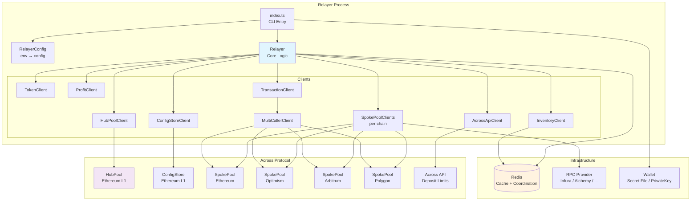
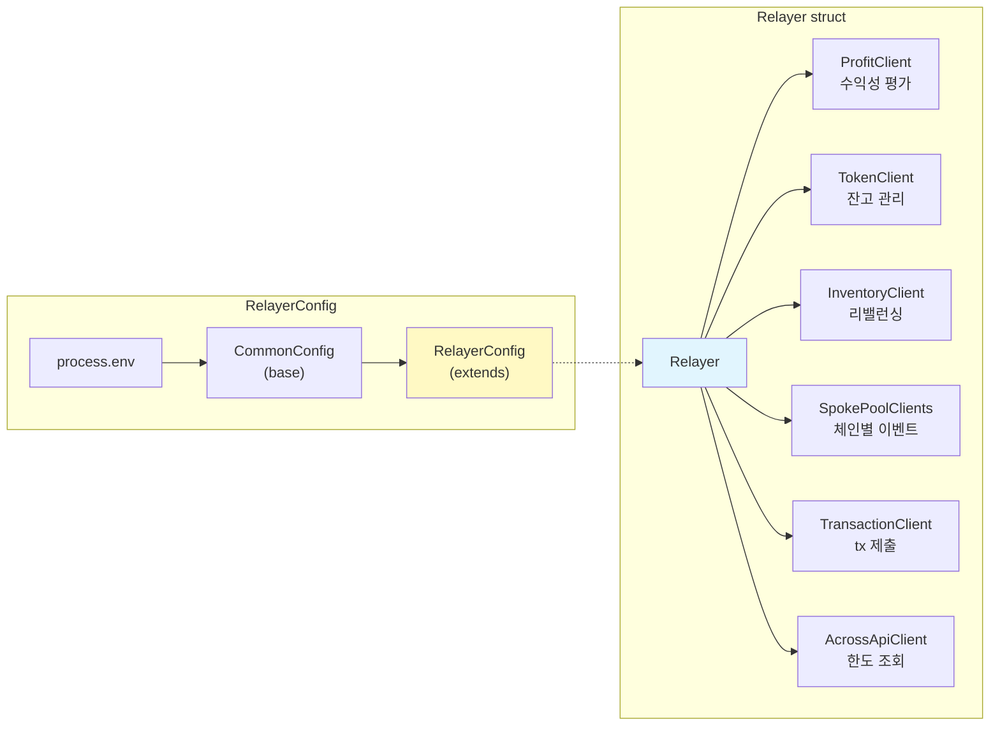
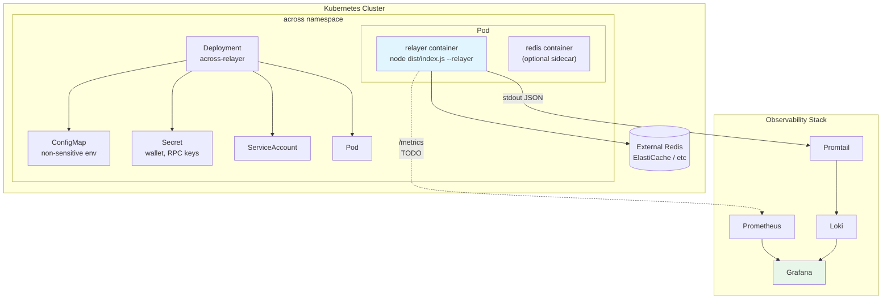
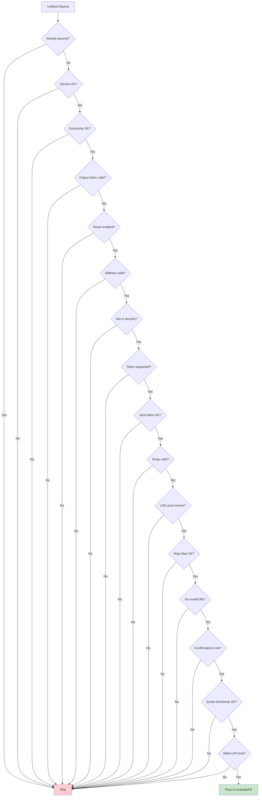

# Relayer 워크플로우 가이드

Across Protocol V3 Relayer의 전체 실행 흐름, 핵심 클라이언트, 환경변수 매핑을 정리한 문서.

> **Go 개발자를 위한 참고**: 이 프로젝트는 TypeScript/Node.js 기반이지만, 아키텍처 패턴은 Go 서비스와 유사합니다.
> - `RelayerConfig` ≈ Go의 config struct (env → struct 매핑, `envconfig` 패키지와 비슷)
> - `constructRelayerClients()` ≈ `wire`나 수동 DI로 의존성 조립
> - 폴링 루프 ≈ `for { select { case <-ticker.C: ... } }` 패턴
> - `interface` 기반 클라이언트 ≈ Go interface + struct 구현체
> - Winston logger ≈ `zap.Logger` 또는 `slog` (구조화 로깅)

---

## 목차

1. [시스템 아키텍처](#1-시스템-아키텍처)
2. [런타임 진입점](#2-런타임-진입점)
3. [Relayer 초기화 흐름](#3-relayer-초기화-흐름)
4. [메인 폴링 루프](#4-메인-폴링-루프)
5. [Deposit 필터 파이프라인](#5-deposit-필터-파이프라인)
6. [Fill 결정 흐름](#6-fill-결정-흐름)
7. [Fill 시퀀스 다이어그램](#7-fill-시퀀스-다이어그램)
8. [핵심 클라이언트 레퍼런스](#8-핵심-클라이언트-레퍼런스)
9. [환경변수 레퍼런스](#9-환경변수-레퍼런스)
10. [상태 관리 & 인스턴스 조율](#10-상태-관리--인스턴스-조율)
11. [로깅 패턴](#11-로깅-패턴)
12. [관측성 현황](#12-관측성-현황)

---

## 1. 시스템 아키텍처

### 전체 시스템 구성



### Relayer 내부 컴포넌트 구조

> Go로 비유하면: `Relayer` struct가 여러 client interface를 필드로 들고 있고,
> `Run()` 메서드가 `for-select` 루프를 도는 구조.



### 배포 아키텍처 (K8s)



---

## 2. 런타임 진입점

### CLI → 봇 선택

```
yarn relay --wallet secret
  ↓ (package.json: "relay": "node ./dist/index.js --relayer")
  ↓
index.ts:69-102
  ├ process.env.ACROSS_BOT_VERSION = version  (L71)
  ├ config()  ← dotenv 로드  (L72)
  ├ minimist로 CLI args 파싱  (L82)
  ├ retrieveSignerFromCLIArgs()  → Signer 생성  (L64)
  └ CMDS[cmd](logger, signer)  → runRelayer 호출  (L65)
```

`CMDS` 맵 (`index.ts:27-42`):

| CLI flag | 함수 | 설명 |
|----------|------|------|
| `--relayer` | `runRelayer` | 메인 릴레이어 |
| `--rebalancer` | `runRebalancer` | 인벤토리 리밸런싱 |
| `--dataworker` | `runDataworker` | 루트 번들 제안/분쟁 |
| `--finalizer` | `runFinalizer` | 크로스체인 완료 처리 |
| `--monitor` | `runMonitor` | 모니터링 |
| `--refiller` | `runRefiller` | 인벤토리 보충 |

### Docker 실행

`scripts/runCommand.sh`는 `$COMMAND` 환경변수를 그대로 실행:
```bash
#!/bin/bash
$COMMAND
```

K8s/Docker에서는 `COMMAND="node ./dist/index.js --relayer --wallet secret"` 형태로 주입.

---

## 3. Relayer 초기화 흐름

`src/relayer/index.ts:44-68` → `runRelayer(_logger, baseSigner)`

```
runRelayer()
│
├─ 1. RelayerConfig 생성  (L54)
│     └ process.env → config 객체 변환
│
├─ 2. Redis 연결  (L59)
│     └ getRedisCache(logger) → 싱글턴 Redis 클라이언트
│
├─ 3. 클라이언트 구축  (L66)
│     └ constructRelayerClients(logger, config, baseSigner)
│       ├ constructClients()  → HubPoolClient, ConfigStoreClient, MultiCallerClient
│       ├ SpokePoolClient × N개 체인
│       ├ AcrossApiClient  → deposit 한도 조회
│       ├ TokenClient  → 토큰 잔고/allowance
│       ├ ProfitClient  → 수익성 평가
│       ├ InventoryClient  → 체인별 잔고 관리
│       └ TransactionClient  → tx 제출/가스 조정
│
├─ 4. Relayer 인스턴스 생성  (L67)
│     └ new Relayer(address, logger, clients, config)
│
├─ 5. 초기화  (L68)
│     └ relayer.init()
│       ├ config.update()  → 주소 필터 로드
│       ├ acrossApiClient.update()
│       ├ tokenClient.update()
│       └ 토큰 approval 설정 (SEND_RELAYS=true 시)
│
└─ 6. API 스케줄러  (L77)
      └ scheduleTask(acrossApiClient.update, 30초)
```

### 이벤트 리스너 모드 (optional)

`RELAYER_EXTERNAL_LISTENER=true` + `RELAYER_EVENT_LISTENER=true` 설정 시:
- Hub chain SpokePoolClient에 `onBlock()` 콜백 등록 (`L79-103`)
- 새 블록마다 configStoreClient + hubPoolClient 업데이트
- 중복 블록 이벤트 방지를 위한 `updates` 맵 유지

---

## 4. 메인 폴링 루프

`src/relayer/index.ts:106-194`

```
for (let run = 1; !aborted; ++run) {
    │
    ├─ relayer.update()                                    (L111)
    │   ├ configStoreClient.update()
    │   ├ hubPoolClient.update()
    │   ├ tokenClient.update()
    │   └ updateSpokePoolClients()  → 체인별 이벤트 새로고침
    │     이벤트: FundsDeposited, RequestedSpeedUpDeposit,
    │             FilledRelay, RelayedRootBundle,
    │             ExecutedRelayerRefundRoot
    │
    ├─ Active Relayer 체크                                  (L112-129)
    │   └ Redis에서 다른 relayer 인스턴스 확인
    │     → 준비 안 됐으면 maxStartupDelay(120s)까지 대기
    │     → 대기 후에도 일부 체인 미동기화면 degraded 상태로 진행
    │
    ├─ Inventory 초기화 (최초 1회)                           (L131-149)
    │   └ Redis 캐시에서 inventory state 로드
    │     또는 inventoryClient.setBundleData() + update()
    │
    ├─ Active Relayer Handover                              (L153-167)
    │   └ Redis에 자신의 RUN_IDENTIFIER 등록/확인
    │     → 새 인스턴스 감지 시 graceful handover
    │
    ├─ relayer.checkForUnfilledDepositsAndFill(simulate)    (L170)
    │   └ [아래 섹션 5, 6, 7 참조]
    │
    ├─ relayer.runMaintenance()                              (L171)
    │   └ 60초마다 실행 (maintenanceInterval)
    │     ├ tokenClient 새로고침
    │     ├ profitClient 새로고침
    │     ├ inventoryClient 업데이트
    │     ├ L2 ETH wrapping (threshold 초과 시)
    │     ├ WETH unwrapping (필요 시)
    │     └ stale ignoredDeposits 캐시 정리
    │
    └─ sleep(pollingDelay - runTime)                         (L186-191)
        └ POLLING_DELAY=0 이면 1회 실행 후 종료
```

---

## 5. Deposit 필터 파이프라인

`src/relayer/Relayer.ts:193-426` → `filterDeposit()`

unfilled deposit 목록에서 각 deposit을 16단계 순차 필터로 검증. **하나라도 실패하면 해당 deposit은 건너뜀**.

```
입력: RelayerUnfilledDeposit
  │
  ├─  1. Already ignored?        (L214)  → 이전에 unfillable로 마킹됨
  ├─  2. Version check           (L218)  → deposit 버전이 현재 코드보다 높음
  ├─  3. Exclusivity             (L230)  → 다른 relayer 전용 + 윈도우 활성중
  ├─  4. Output token valid      (L236)  → 프로토콜 토큰 유효성
  ├─  5. Route enabled           (L245)  → origin/dest 체인 설정에 포함?
  ├─  6. Address validity        (L256)  → 주소 형식 유효?
  ├─  7. Address denylist        (L271)  → depositor/recipient 차단 목록
  ├─  8. Token support           (L282)  → RELAYER_TOKENS에 포함?
  ├─  9. Dest token support      (L304)  → RELAYER_DESTINATION_TOKENS에 포함?
  ├─ 10. Token swap validation   (L317)  → output 토큰 검증
  ├─ 11. Fill amount USD known   (L331)  → 가격 데이터 존재?
  ├─ 12. Message relay support   (L344)  → 메시지 릴레이 가능 체인?
  ├─ 13. Invalid fills check     (L358)  → 이미 잘못된 fill 제출됨?
  ├─ 14. Min confirmations       (L371)  → 블록 확인 수 충족?
  ├─ 15. Quote timestamp         (L388)  → 타임스탬프 유효 범위?
  └─ 16. API deposit limits      (L401)  → API 한도 초과?
```

---

## 6. Fill 결정 흐름

### 6a. 전체 fill 처리 (`checkForUnfilledDepositsAndFill`)

`src/relayer/Relayer.ts:919-1012`

```
checkForUnfilledDepositsAndFill(simulate)
  │
  ├─ _getUnfilledDeposits()          (L941)
  │   └ 체인별 unfilled deposit 수집 + filterDeposit() 적용
  │
  ├─ computeFillLimits()             (L954)
  │   └ USD 기반 fill 한도 계산
  │
  ├─ batchComputeLpFees()            (L956)
  │   └ 모든 repayment chain 조합의 LP 수수료 일괄 계산
  │
  └─ per destination chain:           (L957-996)
      ├─ fill status 조회 (SpokePool)
      ├─ rate limit: 루프 모드에서 최대 25개/루프
      ├─ evaluateFill() × N deposits  (아래 참조)
      └─ executeFills()               (L898)
```

### 6b. 개별 deposit 평가 (`evaluateFill`)

`src/relayer/Relayer.ts:689-832`

```
evaluateFill(deposit, ...)
  │
  ├─ 1. Pending tx 체크        (L700)  → 이미 대기중인 tx 있으면 skip
  ├─ 2. Block confirmation     (L710)  → minDepositConfirmations 충족?
  ├─ 3. Slow depositor 체크    (L726)  → grey list면 slow fill 요청
  ├─ 4. Min fill time          (L739)  → deposit 너무 새로우면 skip
  │
  ├─ 5. Repayment chain 결정   (L767)
  │     └ resolveRepaymentChain()  (L1238)
  │       ├ inventoryClient.determineRefundChainId() → 후보 목록
  │       ├ 각 후보의 수익성 계산
  │       └ 첫 번째 수익성 있는 체인 선택 (없으면 undefined)
  │
  ├─ 6. 수익성 체크             (L777)
  │     ├ tokenClient.hasBalanceForFill()?
  │     ├ repaymentChainId 있으면 → 수익성 OK
  │     ├ 잔고 부족 but 수익성 OK → shortfall 로그
  │     └ 수익성 없음 → 무시 목록에 추가
  │
  ├─ 7. Origin chain limit     (L808)  → USD 한도 초과?
  ├─ 8. 잔고 차감               (L828)  → 로컬 잔고 추적 업데이트
  └─ 9. Fill tx 큐잉            (L831)  → fillRelay() 호출
```

### 6c. Fill 실행

- **EVM**: `fillRelay()` (`L1120`) → `multiCallerClient.enqueueTransaction()`
- **SVM**: `svmFillerClient.enqueueFill()` (`L1188`)
- **Slow Fill**: `requestSlowFill()` (`L1025`) → SpokePool.requestSlowFill()

---

## 7. Fill 시퀀스 다이어그램

### Deposit → Fill 전체 시퀀스

> Go 개발자 참고: 이 시퀀스는 Go에서 `EventWatcher` goroutine이 이벤트를 수신하고,
> `ProcessDeposit()` → `ValidateDeposit()` → `SubmitFill()` 체인을 타는 것과 같은 흐름.
> 차이점은 Node.js가 싱글스레드라 goroutine 대신 폴링 루프 + async/await로 처리한다는 것.

```mermaid
sequenceDiagram
    autonumber
    participant Loop as Polling Loop
    participant R as Relayer
    participant SPC as SpokePoolClients
    participant RPC as RPC Providers
    participant Filter as filterDeposit()
    participant Eval as evaluateFill()
    participant PC as ProfitClient
    participant IC as InventoryClient
    participant TC as TokenClient
    participant TXC as TransactionClient
    participant SP as SpokePool Contract

    Loop->>R: update()
    R->>SPC: updateSpokePoolClients()
    SPC->>RPC: eth_getLogs(FundsDeposited, FilledRelay, ...)
    RPC-->>SPC: events[]

    Loop->>R: checkForUnfilledDepositsAndFill()

    R->>R: _getUnfilledDeposits()
    Note over R: 체인별 unfilled deposits 수집

    loop 각 deposit에 대해
        R->>Filter: filterDeposit(deposit)
        Note over Filter: 16단계 순차 필터<br/>version, exclusivity, route,<br/>token, confirmations, limits...
        alt 필터 통과 실패
            Filter-->>R: false (skip)
        else 필터 통과
            Filter-->>R: true
        end
    end

    R->>R: computeFillLimits()
    R->>R: batchComputeLpFees()

    loop 각 통과된 deposit에 대해
        R->>Eval: evaluateFill(deposit)

        Eval->>Eval: block confirmation 체크
        Eval->>Eval: min fill time 체크

        Eval->>IC: determineRefundChainId()
        IC-->>Eval: repayment chain 후보[]

        loop 각 repayment chain 후보
            Eval->>PC: calculateFillProfitability()
            PC-->>Eval: { profitable, relayerFeePct, gasCost }
        end

        alt 수익성 없음
            Eval-->>R: skip (ignoredDeposits에 추가)
        else 수익성 있음
            Eval->>TC: hasBalanceForFill()
            alt 잔고 부족
                TC-->>Eval: false
                Eval-->>R: skip (shortfall 로그)
            else 잔고 충분
                TC-->>Eval: true
                Eval->>R: fillRelay(deposit, repaymentChainId)
                R->>TXC: enqueueTransaction(fillRelay)
            end
        end
    end

    R->>TXC: executeFills()
    TXC->>SP: fillRelay() tx 제출
    SP-->>TXC: tx receipt
    TXC-->>R: txnHashes[]
```

### Maintenance 사이클

```mermaid
sequenceDiagram
    autonumber
    participant Loop as Polling Loop
    participant R as Relayer
    participant TC as TokenClient
    participant PC as ProfitClient
    participant IC as InventoryClient

    Loop->>R: runMaintenance()
    Note over R: 60초 간격 (maintenanceInterval)

    R->>TC: update()
    Note over TC: 토큰 잔고 새로고침

    R->>PC: update()
    Note over PC: 가격 데이터 새로고침

    R->>IC: update(chainIds)
    Note over IC: 체인별 인벤토리 상태 갱신

    R->>R: wrapL2Eth()
    Note over R: ETH 잔고 > threshold면<br/>WETH로 wrapping

    R->>R: unwrapWeth()
    Note over R: WETH unwrap 필요 시

    R->>R: flushIgnoredDeposits()
    Note over R: stale 캐시 정리
```

### Deposit 필터 파이프라인 (상세)



---

## 8. 핵심 클라이언트 레퍼런스

| Client | 파일 | 역할 | 주요 env vars |
|--------|------|------|---------------|
| **CommonConfig** | `src/common/Config.ts` | 공통 설정 기반 클래스 | POLLING_DELAY, MAX_BLOCK_LOOK_BACK, MAX_RELAYER_DEPOSIT_LOOK_BACK, SEND_TRANSACTIONS |
| **RelayerConfig** | `src/relayer/RelayerConfig.ts` | Relayer 전용 설정 | SEND_RELAYS, RELAYER_ORIGIN_CHAINS, MIN_RELAYER_FEE_PCT, RELAYER_TOKENS, MIN_DEPOSIT_CONFIRMATIONS |
| **ProfitClient** | `src/clients/ProfitClient.ts` | Fill 수익성 평가 | MIN_RELAYER_FEE_PCT, RELAYER_GAS_PADDING, RELAYER_GAS_MULTIPLIER, DEBUG_PROFITABILITY |
| **InventoryClient** | `src/clients/InventoryClient.ts` | 체인별 잔고 관리, 리밸런싱 | RELAYER_INVENTORY_CONFIG, RELAYER_EXTERNAL_INVENTORY_CONFIG |
| **TokenClient** | `src/clients/TokenClient.ts` | 토큰 잔고, allowance 관리 | RELAYER_TOKENS |
| **TransactionClient** | `src/clients/TransactionClient.ts` | Tx 제출, 가스 스케일링 | MAX_FEE_PER_GAS_SCALER, PRIORITY_FEE_SCALER |
| **SpokePoolClient** | `src/clients/SpokePoolClient.ts` | 체인별 이벤트 조회 | RPC_PROVIDERS, NODE_QUORUM, MAX_BLOCK_LOOK_BACK |
| **AcrossApiClient** | (clients/) | Deposit 한도 조회 | RELAYER_IGNORE_LIMITS |
| **RedisCache** | `src/caching/RedisCache.ts` | RPC 응답 캐싱 | REDIS_URL, GLOBAL_CACHE_NAMESPACE |

---

## 9. 환경변수 레퍼런스

### Core Runtime

| 변수 | 기본값 | 읽히는 곳 | 변환 | 용도 |
|------|--------|-----------|------|------|
| `POLLING_DELAY` | `60` | `CommonConfig` (L80) | `Number()` | 봇 루프 간격 (초). 0이면 1회 실행 후 종료 |
| `SEND_RELAYS` | `false` | `RelayerConfig` (L342) | `=== "true"` | fill 트랜잭션 실제 제출 여부 |
| `SEND_SLOW_RELAYS` | `false` | `RelayerConfig` (L343) | `=== "true"` | slow fill 요청 제출 여부 |
| `SEND_TRANSACTIONS` | - | `CommonConfig` (L87) | `=== "true"` | 모든 tx 제출 전역 스위치 |
| `SEND_FINALIZATIONS` | `false` | Finalizer 전용 | `=== "true"` | finalization tx 제출 여부 |

### Chain Selection

| 변수 | 기본값 | 읽히는 곳 | 변환 | 용도 |
|------|--------|-----------|------|------|
| `RELAYER_ORIGIN_CHAINS` | `[]` | `RelayerConfig` (L110) | `JSON.parse` | 릴레이할 origin 체인 목록. 빈 배열 = 전체 |
| `RELAYER_DESTINATION_CHAINS` | `[]` | `RelayerConfig` (L111) | `JSON.parse` | 릴레이할 destination 체인 목록. 빈 배열 = 전체 |
| `SPOKE_POOL_CHAINS_OVERRIDE` | `[]` | `CommonConfig` (L81) | `JSON.parse` | SpokePool 체인 강제 지정 |

### RPC Provider

| 변수 | 기본값 | 읽히는 곳 | 변환 | 체인별 오버라이드 |
|------|--------|-----------|------|------------------|
| `RPC_PROVIDERS` | - | `ProviderUtils.ts` | 쉼표 분리 | `RPC_PROVIDERS_<CHAIN_ID>` |
| `RPC_PROVIDER_<NAME>_<CHAIN_ID>` | - | `ProviderUtils.ts` | URL 문자열 | - |
| `RPC_PROVIDER_KEY_<NAME>` | - | `ProviderUtils.ts` | API key 문자열 | - |
| `NODE_QUORUM` | `1` | `ProviderUtils.ts` (L60) | `Number()` | `NODE_QUORUM_<CHAIN_ID>` |
| `NODE_MAX_CONCURRENCY` | `25` | `ProviderUtils.ts` (L80) | `Number()` | `NODE_MAX_CONCURRENCY_<CHAIN_ID>` |

**RPC 선택 흐름:**
```
RPC_PROVIDERS="INFURA,ALCHEMY"  (또는 RPC_PROVIDERS_137="LLAMANODES,INFURA")
  ↓
각 provider name에 대해:
  1차: RPC_PROVIDER_INFURA_1="https://..." (직접 URL)
  2차: RPC_PROVIDER_KEY_INFURA="abc123" → SDK가 URL 생성
  ↓
RetryProvider 생성 (quorum + concurrency 적용)
```

### Fill Parameters

| 변수 | 기본값 | 읽히는 곳 | 변환 | 용도 |
|------|--------|-----------|------|------|
| `MIN_RELAYER_FEE_PCT` | `0.0001` | `RelayerConfig` (L133) | `toBNWei()` | 최소 수익률 (1 bps) |
| `MAX_RELAYER_DEPOSIT_LOOK_BACK` | `14400` (4h) | `CommonConfig` (L79) | `Number()` | deposit 조회 lookback (초) |
| `MIN_DEPOSIT_CONFIRMATIONS` | Constants | `RelayerConfig` (L346) | `JSON.parse` | USD 임계값별 최소 블록 확인 수 |
| `RELAYER_TOKENS` | `[]` | `RelayerConfig` (L114) | `JSON.parse` → `getAddress()` | 허용 토큰 (L1 주소). 빈 배열 = 전체 |
| `RELAYER_DESTINATION_TOKENS` | `{}` | `RelayerConfig` (L120) | `JSON.parse` | 체인별 허용 토큰 |
| `RELAYER_IGNORE_LIMITS` | `false` | `RelayerConfig` (L405) | `=== "true"` | API 한도 체크 건너뛰기 |

**MIN_RELAYER_FEE_PCT 동적 오버라이드 (ProfitClient에서):**
```
가장 구체적 → 가장 일반적 순서로 탐색:
  MIN_RELAYER_FEE_PCT_USDC_WETH_42161_1  (소스토큰_대상토큰_origin_dest)
  MIN_RELAYER_FEE_PCT_1                   (dest chain)
  MIN_RELAYER_FEE_PCT_USDC                (토큰 심볼)
  MIN_RELAYER_FEE_PCT                     (전역 기본값)
```

### Gas Tuning

| 변수 | 기본값 | 읽히는 곳 | 변환 | 체인별 오버라이드 |
|------|--------|-----------|------|------------------|
| `MAX_FEE_PER_GAS_SCALER` | Constants | `TransactionClient.ts` (L275) | `Number()` | `MAX_FEE_PER_GAS_SCALER_<CHAIN_ID>` |
| `PRIORITY_FEE_SCALER` | Constants | `TransactionClient.ts` (L277) | `Number()` | `PRIORITY_FEE_SCALER_<CHAIN_ID>` |
| `RELAYER_GAS_PADDING` | `25000` | `RelayerConfig` (L337) | `toBNWei()` | gas estimate에 추가할 여유분 |
| `RELAYER_GAS_MULTIPLIER` | `1` | `RelayerConfig` (L338) | `toBNWei()` | gas 비용 승수 |
| `RELAYER_GAS_MESSAGE_MULTIPLIER` | `2.5` | `RelayerConfig` (L339) | `toBNWei()` | 메시지 릴레이 gas 승수 |

### Inventory

| 변수 | 기본값 | 읽히는 곳 | 변환 | 용도 |
|------|--------|-----------|------|------|
| `RELAYER_INVENTORY_CONFIG` | `{}` | `RelayerConfig` (L156) | `JSON.parse` → BigNumber 변환 | 인라인 인벤토리 설정 |
| `RELAYER_EXTERNAL_INVENTORY_CONFIG` | - | `RelayerConfig` (L143) | `readFileSync` → `JSON.parse` | 파일 기반 인벤토리 설정 (우선) |
| `RELAYER_USE_INVENTORY_MANAGER` | `false` | `RelayerConfig` (L140) | `=== "true"` | 외부 inventory manager 사용 |
| `INVENTORY_TOPIC` | `across-relayer-inventory` | `RelayerConfig` (L139) | 문자열 | Redis inventory 키 |

**인벤토리 설정 로드 우선순위:**
```
1. RELAYER_EXTERNAL_INVENTORY_CONFIG (파일 경로) → readFileSync → JSON.parse
2. RELAYER_INVENTORY_CONFIG (인라인 JSON) → JSON.parse
3. {} (빈 설정 = 인벤토리 관리 비활성화)
```

### Caching (Redis)

| 변수 | 기본값 | 읽히는 곳 | 변환 | 용도 |
|------|--------|-----------|------|------|
| `REDIS_URL` | `redis://127.0.0.1:6379` | `RedisUtils.ts` (L18) | URL 문자열 | Redis 연결 |
| `GLOBAL_CACHE_NAMESPACE` | (없음) | `RedisUtils.ts` (L10) | `String()` | Redis 키 prefix |
| `PROVIDER_CACHE_TTL` | `3600` | `ProviderUtils.ts` (L131) | `Number()` | RPC 응답 캐시 TTL (초) |
| `RELAYER_TEST` | `false` | - | `=== "true"` | Redis 요구사항 건너뛰기 |

### Advanced

| 변수 | 기본값 | 읽히는 곳 | 변환 | 용도 |
|------|--------|-----------|------|------|
| `DEBUG_PROFITABILITY` | `false` | `RelayerConfig` (L336) | `=== "true"` | 수익성 디버그 로그 |
| `RELAYER_LOGGING_INTERVAL` | `30` | `RelayerConfig` (L136) | `Number()` | shortfall/unprofitable 로그 간격 (초) |
| `RELAYER_MAINTENANCE_INTERVAL` | `60` | `RelayerConfig` (L137) | `Number()` | maintenance 실행 간격 (초) |
| `RELAYER_MAX_STARTUP_DELAY` | `120` | `src/relayer/index.ts` (L28) | `Number()` | 시작 시 체인 동기화 대기 최대 시간 (초) |
| `RUN_IDENTIFIER` | - | `src/relayer/index.ts` (L26) | 문자열 | Redis 기반 인스턴스 식별자 |
| `BOT_IDENTIFIER` | `across-relayer` | `src/relayer/index.ts` (L27) | 문자열 | Redis 봇 타입 식별자 |
| `ACCEPT_INVALID_FILLS` | `false` | `RelayerConfig` (L344) | `=== "true"` | 잘못된 fill이 있는 deposit 수용 |
| `SLOW_DEPOSITORS` | `[]` | `RelayerConfig` (L128) | `JSON.parse` | slow fill만 처리할 depositor 주소 |

---

## 10. 상태 관리 & 인스턴스 조율

### Stateless 설계

Relayer는 기본적으로 **stateless**. 런 사이에 영속 상태가 없음. 예외는 Redis뿐:

| Redis 용도 | 키 패턴 | TTL | 설명 |
|------------|--------|-----|------|
| Active relayer 추적 | `BOT_IDENTIFIER` | 600s | 현재 활성 인스턴스 ID |
| Inventory state | `INVENTORY_TOPIC` | 900s | 인벤토리 상태 캐시 |
| RPC 응답 캐시 | namespace prefix | `PROVIDER_CACHE_TTL` | eth_getLogs 등 응답 |
| Deposit 캐시 | deposit hash | - | 15분 이상 된 이벤트만 |

### 인스턴스 조율 (Handover)

같은 지갑으로 여러 relayer 인스턴스를 실행하면 **중복 fill**이 발생. Redis를 통한 handover 프로토콜:

```
Instance A (기존)          Redis              Instance B (신규)
     │                      │                      │
     │  set(bot, A, 600s)   │                      │
     │─────────────────────>│                      │
     │                      │  set(bot, B, 600s)   │
     │                      │<─────────────────────│
     │  get(bot) → B        │                      │
     │<─────────────────────│                      │
     │  (B ≠ A → abort)     │                      │
     │  graceful shutdown   │                      │
```

### 인메모리 상태

| 상태 | 위치 | 용도 |
|------|------|------|
| `fillStatus` | `Relayer.ts:62` | deposit별 fill 상태 추적. 루프 간 중복 평가 방지 |
| `ignoredDeposits` | `Relayer.ts:70` | 한 번 unfillable로 판정된 deposit 건너뛰기 |
| `lastLogTime` | `Relayer.ts:65` | shortfall/unprofitable 로그 빈도 제어 |
| `lastMaintenance` | `Relayer.ts:66` | maintenance 실행 빈도 제어 |

---

## 11. 로깅 패턴

### 구성

- **라이브러리**: Winston (`^3.17.0`) + `@risk-labs/logger` (`^1.3.7`)
- **출력**: stdout (JSON 구조화)
- **주입**: DI 패턴. `logger`가 생성자/함수 파라미터로 전달됨

### 구조화 로그 형식

```typescript
logger.debug({
  at: "Relayer::evaluateFill",           // 위치 식별자
  message: "Filling deposit",            // 사람이 읽는 메시지
  deposit,                               // 컨텍스트 데이터
  repaymentChain,
  notificationPath: "across-relayer",    // (선택) 알림 라우팅
  mrkdwn: "formatted markdown",          // (선택) Slack 포맷
});
```

### 로그 레벨 사용 패턴

| 레벨 | 용도 | 예시 |
|------|------|------|
| `debug` | 일상 운영 | deposit skip, 클라이언트 업데이트, 루프 시작/종료 |
| `info` | 주요 상태 변경 | fill 제출, handover 감지 |
| `warn` | 운영 주의 | token shortfall, unprofitable fills, degraded state |
| `error` | 치명적 실패 | invalid fill, 설정 오류, tx 제출 실패 |

### Loki 연동

stdout JSON 로그 → Promtail → Loki로 바로 수집 가능. 추가 설정 불필요.

---

## 12. 관측성 현황

### 현재 있는 것

| 항목 | 상태 | 비고 |
|------|------|------|
| **구조화 로깅** | Ready | Winston JSON → stdout. Promtail/Loki 즉시 연동 가능 |
| **성능 프로파일링** | Ready | SDK `Profiler` 클래스. 루프 실행 시간 측정 |

### 현재 없는 것

| 항목 | 필요한 이유 | 추가 위치 |
|------|-----------|-----------|
| **`/metrics` endpoint** | Prometheus 스크래핑 (fill rate, gas 소비, RPC 에러율) | `src/relayer/index.ts` 또는 별도 HTTP 서버 |
| **`/health` endpoint** | K8s liveness probe, 프로세스 상태 확인 | 동일 HTTP 서버 |
| **OpenTelemetry** | 분산 트레이싱 (현재 단일 프로세스라 우선순위 낮음) | - |

**참고**: CCTP Finalizer만 `/health:8080` endpoint가 있음 (`src/cctp-finalizer/app.ts:29-35`). 메인 Relayer에는 HTTP 서버가 없음.

### 추가 시 수정 필요 파일

```
prom-client + HTTP 서버 추가:
  ├ src/relayer/index.ts          ← HTTP 서버 시작, 메트릭스 수집
  ├ src/relayer/Relayer.ts        ← fill/skip 카운터 증가
  ├ src/clients/ProfitClient.ts   ← 수익성 판정 메트릭스
  ├ src/clients/TransactionClient.ts ← tx 성공/실패, gas 소비
  └ helm/across-relayer/templates/deployment.yaml ← liveness probe 추가
```
